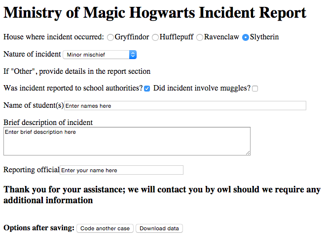

*********************************
Appendix 1: Sample Template File
*********************************

::

    # CIVET template demonstration file

    title: CIVET basic form demonstration

    h1:Ministry of Magic Hogwarts Incident Report

    radio: House where incident occurred: [house]
    Gryffindor, Hufflepuff, Ravenclaw, *Slytherin

    //select:Nature of incident [natincid]
    *Minor mischief, Unauthorized absence, Accident, Major infraction, Unforgivable Curses, Other

    p:If "Other", provide details in the report section

    //checkbox: Was incident reported to school authorities? [authreport]
    No,*Yes

    checkbox: Did incident involve muggles? [muggles]
    No,Yes

    //textline: Name of student(s) [names] width=80
    Enter names here

    //textarea:Brief description of incident [descrp] cols = 80
    Enter brief description here

    //textline:Reporting official [reporter] width=40
    Enter your name here

    h3:Thank you for your assistance; we will contact you by owl should we require any additional information

    save: 
    _date_, house, natincid, authreport, muggles, names, descrp, reporter

This produces the form 

