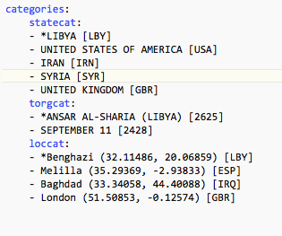
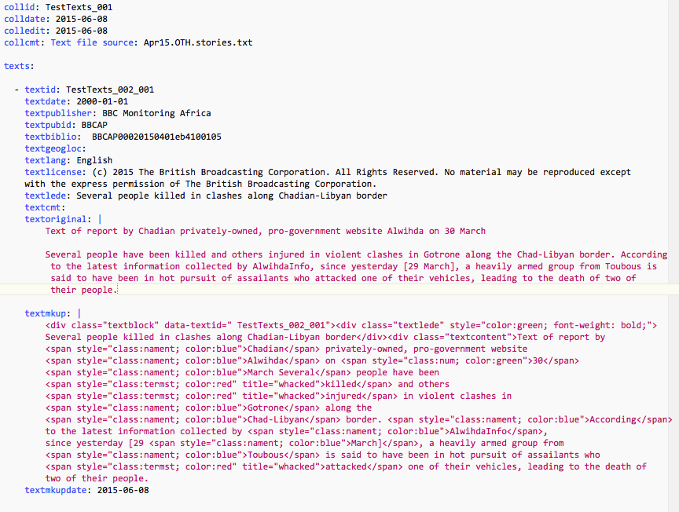

****************************
Appendix 2: Input Format
****************************

Fields marked with \*\* are required. Text fields are limited to 100 characters except 
for:

- ``textoriginal``, ``textmkup`` and ``casevalues`` have no length limitation

- the three comment fields ``collcmt``, ``textcmt`` and ``casecmt`` can be up 
  to 500 characters

- coder ID, which is limited to 32 characters.

========================
Collection fields
========================

collid
    Collection ID, which needs to be unique within the workspace. If
    this is not provided in the file, collfilename is assigned by the
    program

collfilename
    directory and name of the YAML file (without the suffix) where the
    file was read from; this is assigned by the program

colldate
    collection date YYYY-MM-DD

\*\*colledit
    datetime of editing of this collection  [provided by system]

collcmt
    collection comments

categories [optional]
    categories and items for dynamic selection menus (**dynselect**)

texts
    one or more related texts

cases
    zero or more coded records

========================
Category fields
========================

These are all indented: the first line is the category name followed by a required colon (:). This is followed by the 
menu options, one per line preceded by an indent and a hyphen-space (``- ``). If the menu option begins with an asterisk (``\*``)
it is the default value for the menu.  The following figure shows an example of menu items specified for three categories,
``statecat``,``torgcat`` and ``loccat.``

========================
Text fields
========================

\*\*textid
    unique text ID for CIVET. This needs to be unique within the
    workspace, and given how collections might get mixed across
    workspace folders, ideally should be unique for the entire project.
    If a value for the ``text`` field is not provided it will be
    assigned by the program.

\*\*textdate
    text date YYYY-MM-DD

textdelete: 
    Boolean: text has been marked for deletion.

textpublisher
    publisher [any string]

textpubid
    publisher ID [any string]

textbiblio
    bibliographic citation

textgeogloc
    geographical locations

textauthorr
    author [any string]

textlang
    language

textlicense
    copyright notification or other license information

\*\*textlede
    lede/headline/abstract—this is a short summary of the article
    which will be highlighted and also will appear in the sorting
    routine.

textcmt
    comment

\*\*textoriginal
    original text of the story; this will not be modified by the system

textmkup
    marked up text: this is the annotated version of the story with
    any mark-up that has been added either automatically on manually

textmkupdate
    datetime time of editing of this block [provided by system]

textmkupcoder
    coder ID

========================
Case fields
========================

\*\* caseid
    Internal case/event ID. This is assigned by the program and
    probably should not be changed; external IDs can be entered as
    variables.

\*\* casedate
    Date and time this case was coded [provided by system]

casecmt
    comment for case

casecoder
    coder ID

casevalues
    This is a string formatted as a Python dictionary which contains
    pairs of variable names and values

========================
Date formats
========================

[This has not been consistently implemented in Beta-0.9]

Dates are ISO-8601 (http://en.wikipedia.org/wiki/ISO\_8601;
http://www.w3.org/TR/NOTE-datetime; https://xkcd.com/1179/;
http://www.cl.cam.ac.uk/mgk25/iso-time.html) so generally either

-  YYYY-MM-DD

-  YYYY-MM-DDThh:mm:ss

-  YYYY-MM-DDThh:mm:ss[+-]hh:mm

========================
UTF-8 Encodings
========================

The system currently translates `UTF-8 <https://en.wikipedia.org/wiki/UTF-8>`_ 
encodings to `ASCII <https://en.wikipedia.org/wiki/ASCII>`_ using the
Django function ``encoding.smart_str()``. We expect to eventually
convert CIVET to Python 3.x (at present it is Python 2.7) which
is UTF-8 “native” but it isn't there yet, so you are best off doing 
your own conversions during the process of converting the original 
texts to the YAML formatting.

========================
Sample File
========================

The following figure shows an example of a simple YAML file; This is a screen capture of a file being edited with *BBEdit*,
hence the color mark-up. A workspace demonstration file with several collections can also be downloaded in the program.

