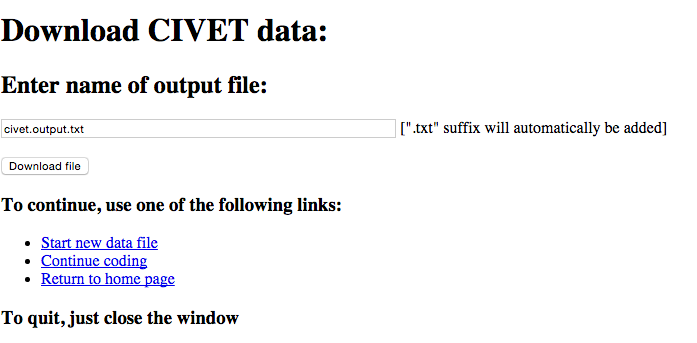

.. _sec-forms:

****************************
CIVET Coding Form Templates
****************************

A CIVET template file specifies the individual components of the form:
these are the familiar components from web forms but the syntax used to
specify them is simpler than what you will find in HTML.

CIVET is simply adding these controls to an HTML ``<form>`` and, as with
all things HTML, most of the placement of the fields is handled by the
browser. [#f1]_ CIVET provides some limited formatting through the
insertion of text and line breaks, and with some experimenting you
should be able to keep the form from being too ugly.

The template file should be a simple text file—most systems are happier
if this ends in the suffix ``.txt``—similar to that used in an *R*
or *Stata* script (that is, not a formatted file such as that
produced by *MS-Word*). Appendix 1 gives an example of a template
file, and the code for this can also be downloaded from a link in the
program.

======================================
Simple Template-Based Data Entry Form
======================================

The basic data entry form just uses the presumably familiar standard
HTML data entry fields and should be self-explanatory. 

To save a set of coded fields, click one of the buttons which follow the
title ``Options after saving:``

Code another case:
    Save, then return to the same form

Download data:
    Save, then download data as a tab-delimited text file

The ``Download CIVET data`` page  provides a
text box for a file name, and the ``Download file`` button downloads the
coded data. Use the *Start new data file* link to re-start the coding
and the *Continue coding with this file* link to continue adding to the
existing records.

-  The .txt file is tab-delimited and contains the variable names in the
   first line.

-  If the file name does not end in “.txt,” this suffix will be added.

================
Command formats
================

Commands generally have the following format

::

          command: entry-title [var-name] options
          comma-delimited list

Commands vary in how many of these components they have, but all follow
this general pattern.

Each command ends with a blank line (or, if you prefer, the commands are
separated by blank lines.)

Commands can also be cancelled by adding a “-” in front of the command:
this will cancel the entire command, that is, all of the lines
associated with the command, not just the first line. For visual
symmetry, a “+” in front of the command “activates” it, though the
command will also be active without the plus.

“#” denotes a comment: anything following a “#” is ignored, so lines
beginning with “#” are completely ignored.

Items in template specification
-------------------------------

The commands involve one or more of the following items:

entry-title
    This is the title of data entry field. If this ends with ``/`` a
    line-break (`` ``) is inserted after the text. The titles are
    escaped: at present the characters <, >and the single and double
    quotes are replaced with the equivalent HTML entities
    ``&lt;, &gt; &quot;`` and ``&rsquo;``. [#f2]_ The **entry-title**
    field cannot contain the characters “[” or “]”—if these are present
    they will be interpreted as bounding the **var-name** field—but the
    escaped versions “\\[” and “\\]” are allowed.

var-name
    The text of the variable name for this field; this will be used in
    the first line of the ``.csv`` output file

comma-delimited-option-list
    A list of the items that can be selected, separated by commas. A
    ‘\*’ at the beginning of the item means that it will be initially
    selected.

comma-delimited-var-name-list
    A list of items which appear in **var-name** fields, separated by
    commas.

page-text
    Any text

number
    An integer
    
Errors in template commands
---------------------------

There is a fair amount of error trapping as the commands are processed;
any problems will reported on a web page. Generally the system will 
stop after it has encountered the first error rather than reporting
all of the errors in the file.

===============================
Specifying variables
===============================

Specifying variables to save
----------------------------

This command gives the variables that will be saved; these can be in any
order but each of these must correspond to a ``var-name`` somewhere in
the form, or are one of the special variables discussed below. A
tab-delimited version of this list will be the first line of the output
file. The command can occur anywhere in the file.

    | **save:**
    | comma-delimited-var-name-list

If the variable name has brackets following it, the *value* of the
variable rather than the literal text will be written when the data are
written to a tab-delimited file: the value is the string in brackets
``[…]`` in the annotated coding mode. If there is a variable name inside
the brackets, that will be used as the column name for the values;
otherwise the regular name will be used: this allows both the literal
text and the value to be saved, as in the third example below. 

If ``save`` specifies a value output and not is found, the output depends
on the preference ``civet_settings.USE_TEXT_FOR_MISSING``, which also can  
be set on the “Preferences” page. If this is ``True``, the text will be
used; otherwise the string in  ``civet_settings.MISSING_VALUE`` will be used.

**Example:**

.. code::
    
    save: 
    worldregion, eyewit, groupname, comments
        
    save:  
    worldregion [regioncode], eyewit, groupname[], comments
    
    save:  
    worldregion, eyewit, groupname, groupname [groupcode], comments

constant
--------

Sets the value of a variable to a constant; this can be used in a
``save:``

    | **constant:** page-text [varname]

**Example:**

    ``constant: Data set 0.2 [data_id]``

filename
--------

Sets the default file name for the downloads: this can be changed before
downloading. 

    | **filename:** page-text

**Example:**

    ``filename: our_wonderful_data.csv``

Special ``save`` variables
---------------------------

``\_coder\_``
    Coder text entered in the *CIVET template selection* page

``\_date\_``
    Current date. this is currently in the form YYYY-MM-DD. [#f3]_

``\_time\_``
    Current time in hh:mm:ss format

========================================================
Commands only relevant in workspaces
========================================================

discard
--------

Sets an initially unchecked checkbox for the special variable
“_discard_”, which can be used 
to indicate that a collection has been evaluated by a coder but nothing
was coded. When this is checked, a case is generated for the collection
containing only the “_discard_” variable; those cases are not used to 
generate data.  

    | **discard:** entry-title 

**Example:**

    ``discard: Texts are not codeable``

comments
--------

Creates a textarea box for the special variable ``_comments_`` which will be
added to the “casecmt” meta-data for the case being coded. ``_comments_``
can also be added to the output data like any other variable, but this
is not required. The default size of the text box is 4 x 64 characters;
alternative sizes can be specified by adding an empty set of brackets
followed by ``rows`` and ``cols`` using the same format as the ``textarea``
command. [#f4]_ 

    | **comments:** entry-title 
    | **comments:** entry-title [] rows = number cols = number

**Example:**

    ``comments: Enter any additional comments about this case``

header
--------

Sets the HTML code for the display of collection information at the 
top of the editing and coding screens. The text of ``field-name`` will
be substituted for the optional token ``_text_`` in ``HTML-text``

    | **header:** HTML-text [field-name] 

``field name`` should be one of the following

``workspace``
    Workspace file name
    
``collection``
    Collection ID (``collid`` field)
    
``comments``
    Collection comments (``collcmt`` field)
    
The three fields are displayed in this order; they default to null strings.
The individual ``header`` commands must be separated by blank lines; otherwise,
consistent with the command syntax, [#f5]_ the latter lines will be ignored. 
    
**Example:**

::

    header: <h3>Workspace _text_ </h3>' [workspace]
    
    header: <b>Collection:</b> _text_ ' [collection]

Special ``save`` variables for workspaces
-----------------------------------------

These variables will not include any texts that were deleted using 
``shift-click`` on the lede. [#f6]_

\_publisher\_
    Comma-delimited list of the ``textpublisher`` fields of the texts in
    the collection

\_bibliorefs\_
    Comma-delimited list of the ``textbiblio`` fields of the texts in
    the collection

============================
Data entry fields
============================

Any of these commands can be prefixed with “//”, which inserts a ``

``
or a “/”, which inserts a `` ``.

Checkbox
--------

A simple binary check-box. The value of the variable will be first item
in the list when the box is not checked; the second item when the box is
checked. The \* notation on the second item can be used to specify
whether or not the box is initially checked.

    | **select:** entry-title [var-name]
    | comma-delimited-option-list

**Example:**

    ``select: Eyewitness report? [eyewit] no,*yes``

Select from pull-down menu
--------------------------

Pull-down menus—which are called a “select” in HTML—are specified with
the syntax

    | **select:** entry-title [var-name]
    | comma-delimited-option-list

**Example:**

    ``select: Region [worldregion] North America, South America, Europe, *Africa, Middle East, Asia``

Radio buttons
-------------

A series of radio buttons are specified with the syntax

    | **radio:** entry-title [var-name]
    | comma-delimited-option-list

The entry ``/`` in the option list causes a line-break (`` ``) to be
inserted

**Example:**

    ``radio: Region/ [worldregion] North America, South America, Europe, *Africa, /,Middle East, Asia``

Enter single line of text
-------------------------

This creates a box for a single line of text (HTML `` type=text``). The
``width = number`` is optional and specifies the size of the text entry
box in characters: the default is ``width = 32``

    | **textline:** entry-title [var-name] width = number
    | initial-text

**Example:**

    ``textline: Name of group [groupname] <enter name>``

Extract single line from annotated text
---------------------------------------

This creates a box for a single line of text (HTML `` type=text``) that
will interact with annotated text; in addition information can be
manually entered or cut-and-pasted into this box. If this command is
used in a form that does not have associated annotated text, it behaves
the same as ``textline`` and the ``class`` information is ignored.

The ``class=class-name`` is required and specifies the name of the
annotation class that the text-entry box is connected with; a class can
be associated with multiple text-entry boxes. There are four standard
classes:

-  ``nament``: named-enties, which are determined by capitalization

-  ``geogent``: geographical locations, which are determined by a 
    combination of prepositions and capitalization [#f7]_

-  ``num``: numbers

-  ``date``: dates

The ``width = number`` is optional and specifies the size of the text
entry box in characters: the default is ``width = 32``

    | **textclass:** entry-title [var-name] class=class-name
      width=number
    | initial-text

**Example:**

    ``textclass: Name of city [cityname] class=nament <enter city>``

Enter multiple lines of text
----------------------------

This corresponds to an HTML “TEXTAREA” object. The
``rows = number cols = number`` is optional and specifies the size of
the text entry box in characters: the default is ``rows = 4 cols = 80``

    | **textarea:** entry-title [var-name] rows = number cols = number
    | initial-text

**Example:**

::

   textarea: Description [descript] rows = 2 cols = 64
   Briefly describe the incident
    
.. Date [this wasn't implemented in Version 1.0 but should be in the future
    ----

    Corresponds to a Django DateField(): https://docs.djangoproject.com/en/1.8/ref/forms/fields/#datefield

        | **date:** entry-title [var-name] 

    This field is currently set to use the default allowable formats:

    - %Y-%m-%d' : '2006-10-25'

    - '%m/%d/%Y' : '10/25/2006'

    - '%m/%d/%y' :  '10/25/06'

    Additional formats can be added by changing the ``forms.DateField`` call in *forms.py*; these
    are specified using the extensive Python date format operators shown `here. <http://strftime.org/>`_

==========================================
Additional web page formatting
==========================================

Set page title
--------------

Sets the title of the web page: that is, the HTML``<title>...</title>`` 
section of the header.

    | **title:** page-title

**Example:**

    ``title: CIVET-based coding form``

Insert text
-----------

Adds text to the form: the various options follow the usual HTML
formats. In interests of simplicity, text is “escaped” so that special
characters are not interpreted as HTML: note that this means that
in-line mark-up such as ``<i>``, ``<b>`` and ``<tt>`` will not work,
so if you need this activate and use the ``html:`` command. Also keep in
mind that these commands need to be separated by a blank line.

A “/” in the page-text will add a line-break `` ``. To include a 
“/” in the text, use “//”.

    | **h1:** page-text
    | **h2:** page-text
    | **h3:** page-text
    | **h4:** page-text
    | **p:** page-text

**Example:**

::

        h1: Primary data set coding form

        p:Please enter data in the fields below,/ and be really, really careful!

The simple command

::

    p:

is useful for putting some space between form elements; this is equivalent to the
“//” prefix in the data entry commands.

Insert a line break
-------------------

Adds a new line in the form; this is equivalent to the “/” prefix in the 
data entry commands.

    **newline:**
    
======================================
Advanced formating options
======================================

A CIVET form is simply a web page, and consequently can be controlled by 
the standard commands for displaying web pages, notably cascading style sheets (CSS). 

Set css
-------

Adds the text which follows the command to the ```` section 
in the page head. The text block is terminated by a blank line.

    | **css:**
    | one or more lines of css definitions

Set form division sizes
-----------------------

This is a short-cut that for most options just changes the size of various components in either of these 
forms:

    | **size:** [division-name] width = <length> height = <length>
    | **size:** [division-name] width : <length>; height : <length>
    
<size> can be any of the CSS “length” formats: http://www.w3schools.com/cssref/css_units.asp.

*division-name* is one of the following: 

*body*
    over-all size of the page
    
*civ-editor*
    size of CKEditor text box on the annotation page
    
*civ-text-display*
    size of the scrolling text display on the coding page
    
*civ-form*
    size of the coding form created by the template in both the basic form and the coding page
    
**Notes:**

1. 
    The system does not check for the validity of either the division names or the 
    CSS *<length>* specification; if they can't be interpreted
    they are ignored.

2. 
    ``size`` commands can occur anywhere and can be combined with a ``css`` command:
    if they occur before the ``css`` command the contents of ``css`` will override ``size``,
    and vice-versa if they occur afterwards: the CSS string for the 
    ```` section is assembled in the order the commands occur.

3. 
    Because CSS doesn't use object-like inheritance, the ``size: [body]``  command resets 
    *all* of the properties of ``body``, leaving only ``width`` and ``height`` set in the style, e.g. 
    
    .. code::
    
        body {
            width:900px;
            height:700px;
        }

    If you want to change the size but also retain other characteristics, use ``css``
    to define the complete ``body`` style.

4. 
    The ``civ-editor`` command changes the size in the configuration of CKEditor rather than
    any CSS, so this name cannot be used in  ``css:`` (well, it can be used but it won't
    do anything...). CKEditor does not allow the “%” option to be used as a “height”:
    see http://docs.ckeditor.com/#!/guide/dev_size. The CKEditor defaults to the width 
    of the page (more or less) and a height of 200px. 

5. 
    The  ``civ-form`` and ``civ-text-display`` names correspond correspond to ``
`` 
    in the content of the form; you can modify these directly by using a ``css:``command. 
    The ``size`` command resets the *<name>-size* class, which only controls the size.

Insert HTML
-----------

[This command may or may not be included in the operational version of
the system, as it provides some opportunities for mischief. Stay tuned.
It is in the code but currently deactivated; if you are installing your
own version of the system, it can be activated by setting 
``civet_settings.HTML_OK = True``.]

Adds arbitrary HTML code without escaping.

    | **html:** 
    | one or more lines of HTML 

.. rubric:: Footnotes

.. [#f1]
   Writing in HTML5 and CSS, one can actually exercise a very fine
   degree of control over the placement, but if you are comfortable with
   that sort of code, you presumably aren’t using CIVET in the first
   place. That said, you can see the HTML generated by CIVET by using
   the *View source* option in your browser, then save it as a file
   using *Save Page As...* and that could provide a starting point for
   creating prettier code.

.. [#f2]
   In the current implementation, named HTML entities such as ``&copy;``
   and ``&euro;`` can be included and should produce the correct
   character. At present numbered entities such as ``&#91;``—the HTML
   equivalent of ’]’—do not work since the # is interpreted as a comment
   delimiter: depending on whether there is demand for this feature, the
   system could provide a way around this.
   
..  [#f3]
    This format can be changed in the function ``get_special_var(avar)`` in 
    *civet_form.py*: It is specified using the extensive Python/C date format 
    operators shown `here. <http://strftime.org/>`_
    
.. [#f4]
    In fact, the ``comments:`` command is just a shorthand for 
    ``textarea: entry-text [_comments_]``, and this will have the same
    effect, with the contents added to the metadata.

.. [#f5]
    Neither a bug nor a feature: just is what it is.

.. [#f6]
    At present, only these two fields are available, but it is relatively
    straightforward to add the others by just following the existing 
    code that you locate in a search for “textpublisher”    

.. [#f7]
    This is only done in the automatic annotation if 
    ``civet_settings.USE_GEOG_MARKUP = True``: see the discussion in the
    *Preferences* chapter.

    
    