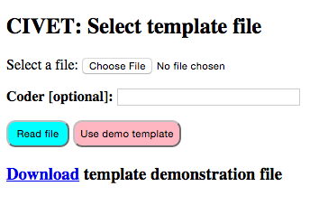

****************************
Home Page Options
****************************

The home page has the following links:

**Read coding form:**
    Civet reads a coding form template without using a workspace: this
    is used if you want to use the web coding form without annotated
    texts. This option can also be used when debugging coding forms.
    Further instructions for the template-only mode are given in Section
    [sec:template].

**Read workspace:**
    Civet reads a set of text collections and their associated coding
    form from a zipped file: this mode allows for text annotation and
    extraction and is described in more detail in Section
    [sec:workspace], [sec:annotate] and [sec:coding].

**Manage workspace:**
    This links to various utilities that operate on workspace files
    (Section [sec:workspace]) including downloading the coded data as a
    tab-delimited file, editing the meta-data, and adding comments to
    the file. [Beta 0.7: only the data download is implemented]

**Set preferences:**
    This goes to a page where various program preferences can be set
    manually. [Beta 0.7: not currently implemented]

**Documentation**

    **On-line manual**
        Links to an HTML version of the documentation

    **Download PDF**
        This downloads a PDF file with the documentation.

File selection
==============

The first three modes go to a file selection screen.

   Civet file selection screen

This provides the following options:

Choose file:
    Select a file containing a coding form template or workspace, then
    read this into the system by clicking the ``Read file`` button.

Coder:
    Any text entered here—typically a coder name or ID—will be included
    as metadata with any annotations or cases coded. This field is
    optional.

Demo file:
    Read the simple demonstration files built into the system. [#f1]_

Download demonstration file:
    This downloads a template or workspace demonstration file, which can
    be used as an example.

.. only:: html

    Footnotes
    ---------

.. [#f1]
   These files are named ``CIVET.demo.template.txt`` and
   ``CIVET.extract.demo.zip`` in the directory
   ``djcivet_site/djciv_data/static/djciv_data/`` and can be modified
   there.

