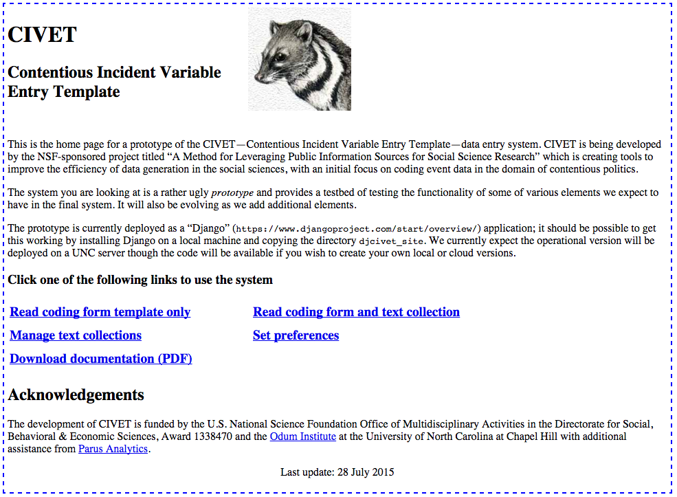

****************************
Installing CIVET
****************************

To date we’ve only installed the system on Macintosh computers, though
the only difference between a Macintosh installation and other
installations should be the installation of the Django system.

On Macintoshes running OS-X 9 and 10, the required Python 2.7 comes
pre-installed. The ``pip`` installation program may also be
pre-installed—I’m having trouble determining this from the Web, and
forget whether I had to install it when I last upgraded—but if not,
install that.

#. In the Terminal, run ``sudo pip install Django``: you will need
   administrative access to do this.

#. Download the Civet system from
   https://github.com/civet-software/CIVET-Django, unzip the folder and
   put it wherever you would like

#. In the Terminal, change the directory so that you are in the folder
   *Django\_CIVET/djcivet\_site*

#. In the Terminal, enter ``python manage.py runserver``

#. In a browser, enter the URL http://127.0.0.1:8000/djciv_data/

At this point you should see the Civet home screen

